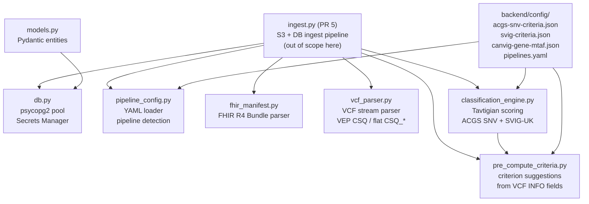

# DESIGN — variant-viewer backend core (PRs 2–5)

## 1. Problem statement

The Variant Viewer is being refactored from Next.js 15 to FastAPI + React SPA
(Option A). PRs 2–4 port the foundational Python business-logic layer: database
access, VCF parsing, FHIR manifest handling, and the ACGS SNV / SVIG-UK
classification scoring engine. The existing TypeScript implementations in
`discovery/nextjs:lib/` are the authoritative reference. The Python port must
produce bit-identical classification scores and labels for the same inputs.

---

## 2. Architecture



---

## 3. Module responsibilities

### 3.1 `app/lib/models.py`

**Responsibilities:**
- Defines one Pydantic v2 `BaseModel` per database table.
- Provides `Literal` type aliases (`Framework`, `Strength`, `CaseType`,
  `WorkflowStatus`, `Classification`) shared across all other modules.
- Validates field types and allowed values on construction.

**Public interface:**
```python
Framework = Literal["acgs_snv", "svig"]
Strength  = Literal["very_strong", "strong", "moderate", "supporting", "standalone"]
CaseType  = Literal["germline", "somatic"]
WorkflowStatus = Literal["pending", "reviewing", "reported", "archived"]
Classification = Literal[
    "Pathogenic", "Likely_Pathogenic", "VUS",
    "Likely_Benign", "Benign", "Oncogenic", "Likely_Oncogenic"
]

class Patient(BaseModel): ...        # mirrors patients table
class Sample(BaseModel): ...         # mirrors samples table
class Variant(BaseModel): ...        # mirrors variants table
class VariantClassification(BaseModel): ...   # mirrors variant_classification
class ClassificationCriterion(BaseModel): ... # mirrors classification_criterion
class WorkflowRecord(BaseModel): ... # mirrors workflow
class AuditEntry(BaseModel): ...     # mirrors audit_log
```

**Must NOT:**
- Import from any other `app.lib.*` module (no circular deps).
- Perform I/O or DB queries.

---

### 3.2 `app/lib/db.py`

**Responsibilities:**
- Resolves database credentials: reads `DB_SECRET_ARN` from environment and
  calls AWS Secrets Manager if set; otherwise expects `DATABASE_URL`.
- Manages a module-level `psycopg2.pool.ThreadedConnectionPool` (minconn=1,
  maxconn=10).
- Exposes `query()` for SELECT-style queries returning `list[dict]`.
- Exposes `with_transaction()` context manager for multi-statement writes.

**Secrets resolution algorithm (steps must execute in order):**
1. If `_secrets_resolved` is already `True`, return immediately.
2. Read `DB_SECRET_ARN` from `os.environ`.
3. If set: call `boto3.client("secretsmanager").get_secret_value()`, parse JSON.
   Validate that `username`, `password`, `host`, and `dbname` are all present;
   raise `RuntimeError` if any are missing.
4. Build `DATABASE_URL` as
   `postgresql://{user}:{password}@{host}:{port}/{dbname}` using `urllib.parse.quote_plus`
   for user and password; port defaults to 5432.
5. If `DATABASE_URL` is still absent after step 4, raise `RuntimeError`.
6. Set `_secrets_resolved = True`.

**Pool initialisation algorithm:**
1. Call `_resolve_secrets()`.
2. If `_pool` is not `None`, return the existing pool.
3. Read `DATABASE_URL` from `os.environ`.
4. Set `sslmode=require` in the dsn when `APP_ENV == "production"`.
5. Create `ThreadedConnectionPool(minconn=1, maxconn=10, dsn=conn_str)`.

**Public interface:**
```python
def query(sql: str, params: tuple = ()) -> list[dict]: ...

@contextmanager
def with_transaction() -> Generator[psycopg2.extensions.connection, None, None]: ...

# Test helpers (allow resetting module-level state between tests)
def _reset_pool() -> None: ...  # sets _pool = None, _secrets_resolved = False
```

**Must NOT:**
- Log the value of `DATABASE_URL`, the Secrets Manager response body, or any
  credential field.
- Raise exceptions that include raw credential strings in their message.

**Design rationale:**

*ThreadedConnectionPool (minconn=1, maxconn=10)*

Opening a PostgreSQL connection is expensive: TCP handshake, TLS negotiation,
authentication, and session initialisation happen on every new connection.
Doing this per-request would dominate query latency under load. A pool
amortises that cost by reusing connections across requests.

`ThreadedConnectionPool` is used rather than the plain `SimpleConnectionPool`
because `db.py` uses psycopg2, which is a **synchronous, blocking** driver.
All DB calls must be dispatched into a thread pool (`asyncio.to_thread`) in
the route layer so they do not block the FastAPI event loop (see §7,
limitation 1). Multiple OS threads will therefore call `getconn()` /
`putconn()` concurrently. `ThreadedConnectionPool` protects these operations
with a `threading.Lock`; `SimpleConnectionPool` has no thread safety and
would produce race conditions here.

- **`minconn=1`** — one connection is opened at initialisation and kept alive,
  so the first real request does not pay the connection-establishment cost.
  Pre-opening more connections at startup would waste RDS memory and connection
  slots when the app is idle or restarts frequently after deployments.
- **`maxconn=10`** — caps concurrent DB connections. uvicorn's default thread
  pool uses `min(32, os.cpu_count() + 4)` threads; on a 1–2 vCPU Fargate task
  that is roughly 5–6 threads, so 10 gives comfortable headroom. RDS
  `db.t3.micro` allows ~80 connections; staying within 10 leaves room for
  migrations, admin queries, the Lambda ingest function, and future task
  replicas without risking connection exhaustion.
- **Module-level singleton** — the pool is created once (guarded by `_pool is
  None`) and shared for the lifetime of the process. `_reset_pool()` exists
  only to clear module-level state between test cases.

*sslmode=require in production*

The application stores patient-identifiable data (lab numbers,
dates of birth). NHS DSPT v8 and UK GDPR both require encryption in transit
for data containing patient identifiers. Setting `sslmode=require` enforces
this at the driver level: psycopg2 will refuse to connect unless the server
presents a TLS certificate and all traffic is encrypted. Trusting that RDS
defaults to encrypted traffic is not sufficient as an auditable control.

The guard `APP_ENV == "production"` is necessary because the local development
and CI environment uses a plain Docker PostgreSQL container (from
`docker-compose.yml`) that has no TLS certificates configured. Setting
`sslmode=require` unconditionally would break `docker compose up` and all
unit/integration tests. No patient data is present in local or CI environments,
so plaintext connections are acceptable there.

Note: `sslmode=require` encrypts traffic but does not verify the server's
certificate chain or hostname. `sslmode=verify-full` would provide stronger
protection against a man-in-the-middle attack by validating RDS's AWS-issued
certificate. This is a known gap; upgrading to `verify-full` (with the RDS CA
bundle mounted into the container) is deferred to a later infrastructure PR.

---

### 3.3 `app/lib/pipeline_config.py`

**Responsibilities:**
- Loads `backend/config/pipelines.yaml` once (module-level lazy init).
- Provides `get_pipeline_config(key)`, `get_pipeline_keys()`, and
  `get_default_filters(key)`.
- Detects the pipeline key from VCF `##source` / `##pipeline` header lines by
  case-insensitive substring match against each pipeline's `header_pattern`.

**Public interface:**
```python
@dataclass
class PipelineFilters:
    gnomad_af_max: float
    consequences: list[str]
    clinvar_exclude: list[str]

@dataclass
class PipelineConfig:
    label: str
    header_pattern: str
    default_filters: PipelineFilters

def get_pipeline_config(key: str) -> PipelineConfig | None: ...
def get_pipeline_keys() -> list[str]: ...
def get_default_filters(pipeline_key: str) -> PipelineFilters: ...
def detect_pipeline_key(header_lines: list[str]) -> str | None: ...
```

**Must NOT:**
- Search for the YAML file relative to cwd at test time; resolve the path
  relative to the module file itself so tests work from any working directory.

---

### 3.4 `app/lib/fhir_manifest.py`

**Responsibilities:**
- Parses a FHIR R4 Bundle (as a Python dict) into a typed `ParsedManifest`.
- Extracts `lab_number` from the `Patient.identifier` array preferring
  `system == NHS_LAB_SYSTEM`; falls back to the first identifier with no system.
- Reads `case_type` from the `Specimen` extension
  `https://example.org/fhir/StructureDefinition/case-type`; raises `ValueError`
  if the extension is absent or the `valueCode` is not `"germline"` or `"somatic"`.
- Builds a FHIR R4 Bundle from typed fields via `build_manifest()`.

**Public interface:**
```python
NHS_LAB_SYSTEM = "https://fhir.example-lab.org/Id/lab-number"
CASE_TYPE_EXT  = "https://example.org/fhir/StructureDefinition/case-type"

@dataclass
class ManifestPatient:
    lab_number: str
    name: str | None
    dob: str | None   # "YYYY-MM-DD"

@dataclass
class ManifestSpecimen:
    sample_name: str
    case_type: Literal["germline", "somatic"]
    tissue: str | None
    sequencing_date: str | None   # "YYYY-MM-DD"

@dataclass
class ManifestTask:
    pipeline_key: str | None
    pipeline_version: str | None
    run_id: str | None
    vcf_filename: str | None

@dataclass
class ParsedManifest:
    patient: ManifestPatient
    specimen: ManifestSpecimen
    task: ManifestTask

def parse_manifest(raw: dict) -> ParsedManifest: ...
def build_manifest(
    patient: ManifestPatient,
    specimen: ManifestSpecimen,
    task: ManifestTask,
) -> dict: ...
```

**Must NOT:**
- Validate the outer Bundle structure against `manifest-schema.json` — that is
  the ingest layer's responsibility (PR 5).
- Make any network calls.

---

### 3.5 `app/lib/vcf_parser.py`

> **PR 3 status:** Built with a hand-rolled line parser (merged via PR #18).
> **PR 5 action:** Migrate to `cyvcf2` (htslib-backed). The public dataclasses
> (`VcfVariant`, `VcfMeta`) and all CSQ extraction logic are unchanged; only
> the parsing loop and function signature change. See §3.5.1 for rationale.

**Responsibilities:**
- Parses a VCF or BCF file using `cyvcf2` (PR 5+); prior to PR 5 used a
  hand-rolled line parser.
- Extracts `CHROM`, `POS`, `REF`, `ALT`, `QUAL`, `FILTER`, `INFO` from each
  data line; calls `on_variant` callback for each parsed `VcfVariant`.
- Splits multi-allelic ALT fields; emits one `VcfVariant` per ALT allele;
  skips spanning deletions (`*`).
- Extracts VEP annotations from two sources in priority order:
  1. VEP `CSQ` field — parsed using the `##INFO=<ID=CSQ,...,Format: A|B|C>`
     header; prefers canonical transcript (`CANONICAL=YES`); selects the
     allele-matching entry first.
  2. Flat `CSQ_*` INFO fields — East Genomics pipeline pre-exploded format.
- Detects pipeline from `##source` / `##pipeline` header lines.
- Returns `VcfMeta` (pipeline\_key, header\_lines) after the file is exhausted.

**SpliceAI max delta computation:**
`spliceai_max = max(DS_AG, DS_AL, DS_DG, DS_DL)` where each is taken from
`SpliceAI_pred_DS_<X>` (VEP CSQ) or `CSQ_SpliceAI_pred_DS_<X>` (flat). NaN
values are ignored. Returns `None` if no valid scores found.

**Public interface (PR 5+):**
```python
@dataclass
class VcfVariant:
    chrom: str
    pos: int
    ref: str
    alt: str
    qual: float | None
    filter: str | None
    gene: str | None
    consequence: str | None
    hgvs_c: str | None
    hgvs_p: str | None
    gnomad_af: float | None
    clinvar_sig: str | None
    revel_score: float | None
    spliceai_max: float | None
    info_json: dict[str, object]

@dataclass
class VcfMeta:
    pipeline_key: str | None
    header_lines: list[str]

def parse_vcf(
    path: str | Path,
    on_variant: Callable[[VcfVariant], None] | None = None,
) -> VcfMeta: ...
```

**Must use `cyvcf2` (PR 5+):**
- The main parsing loop **must** use `cyvcf2.VCF(str(path))` for iteration.
- VCF field access uses `cyvcf2` variant attributes (`v.CHROM`, `v.POS`,
  `v.REF`, `v.ALT`, `v.QUAL`, `v.FILTER`, `v.INFO.get(...)`).
- CSQ string extraction (splitting on `|`, canonical transcript selection,
  SpliceAI max computation) remains custom — `cyvcf2` does not parse VEP.
- Header lines for pipeline detection: `str(vcf.raw_header).splitlines()`.

**Must NOT:**
- Open files using the standard library `open()` — pass a path to `cyvcf2.VCF`.
- Re-implement the hand-rolled `_parse_info` tokeniser — use `v.INFO` directly.

#### 3.5.1 Why cyvcf2 (and why in PR 5, not PR 3)

CNVs are on the variant-viewer roadmap. Structural/copy-number variants
require BCF and symbolic allele support (`<DEL>`, `<DUP>`, `<CNV>`), which the
hand-rolled text parser cannot handle. `cyvcf2` wraps `htslib`, the field
standard for VCF/BCF I/O, and handles:

- BCF (binary) and BGZF-compressed VCF natively
- Symbolic alleles and SVs
- Multi-sample FORMAT columns (needed for tumour/normal pairs)
- Edge-case INFO encoding that the hand-rolled parser would silently mangle

The migration was deferred to PR 5 (not PR 3) because:
1. PR 3 needed to ship quickly for the demo; adding a C-extension dependency
   would have required Dockerfile and CI changes that were out of scope.
2. PR 5 (Lambda ingest) is the first point where the parser runs against
   real S3 VCF files — the natural integration point for the change.
3. The Lambda handler downloads VCFs to `/tmp/` before processing, so the
   API change from `Iterable[str]` to `path: str | Path` fits naturally.

---

### 3.6 `app/lib/classification_engine.py`

**Responsibilities:**
- Implements Tavtigian point-based scoring for ACGS SNV and SVIG-UK frameworks.
- `classify()` — sums points for applied criteria, checks combination rules,
  applies standalone overrides, returns `ClassificationResult`.
- `select_framework()` — returns `(framework, is_canvig)` based on case type
  and whether the gene is in the CanVIG gene list (case-insensitive lookup).
- `get_framework_version()` — returns the framework version string.
- `classification_label()` — human-readable display label.

**ACGS SNV scoring algorithm (steps must execute in order):**
1. Filter `criteria` to only `applied == True`.
2. Check each `combination_rule`: if 2+ codes from the same rule are applied,
   append the rule's `message` to warnings.
3. If any criterion with `criterion_code == "BA1"` is applied, return
   `ClassificationResult(score=-999, classification="Benign", warnings=warnings)`
   immediately.
4. For each applied criterion, determine direction using `_get_direction(code)`:
   - code matches `^(PVS|PS|PM|PP)`: pathogenic direction.
   - code matches `^(BA|BS|BP)`: benign direction.
5. Sum points:
   - pathogenic: `STRENGTH_POINTS[strength]` (very\_strong=8, strong=4,
     moderate=2, supporting=1). `standalone` treated as very\_strong (8pts).
   - benign: `BENIGN_STRENGTH_POINTS[strength]` (standalone=−∞ handled in BA1
     step above, strong=−4, moderate=−2, supporting=−1).
6. If fewer than 2 criteria applied and `score != 0`, append minimum-criteria
   warning.
7. Classify by score: `≥10` → Pathogenic, `≥6` → Likely\_Pathogenic, `≥0` →
   VUS, `≥−6` → Likely\_Benign, else Benign.

**SVIG-UK scoring algorithm (steps must execute in order):**
1. Filter to applied criteria. Check combination rules (same as ACGS step 2).
2. If O1 applied: return `ClassificationResult(score=999, classification="Oncogenic", ...)`.
3. If B1 applied: return `ClassificationResult(score=-999, classification="Benign", ...)`.
4. If B2 applied: return `ClassificationResult(score=0, classification="VUS", ...)`.
5. Determine direction: code matches `^O` → oncogenic; code matches `^B` →
   benign. Sum points using same tables as ACGS.
6. Classify: `≥10` → Oncogenic, `≥6` → Likely\_Oncogenic, `≥0` → VUS,
   `≥−6` → Likely\_Benign, else Benign.

**Strength point tables:**

| Strength | Pathogenic / Oncogenic | Benign |
|---|---|---|
| very\_strong | 8 | n/a |
| strong | 4 | −4 |
| moderate | 2 | −2 |
| supporting | 1 | −1 |
| standalone | 8 (pathogenic) | −∞ (BA1/B1/B2 handled as sentinels) |

**Public interface:**
```python
ACGS_VERSION = "ACGS 2024 Best Practice Guidelines"
SVIG_VERSION = "SVIG-UK v1.0"

@dataclass
class AppliedCriterion:
    criterion_code: str
    applied: bool
    strength: str     # Strength literal

@dataclass
class CombinationRule:
    rule: str
    codes: list[str]
    message: str

@dataclass
class ClassificationResult:
    score: int
    classification: str   # Classification literal
    warnings: list[str]

def classify(
    criteria: list[AppliedCriterion],
    framework: Framework,
    combination_rules: list[CombinationRule],
) -> ClassificationResult: ...

def select_framework(
    case_type: CaseType,
    gene: str | None,
) -> tuple[Framework, bool]: ...   # (framework, is_canvig)

def get_framework_version(framework: Framework) -> str: ...
def classification_label(classification: str) -> str: ...
def classification_badge_class(classification: str) -> str: ...
```

**Must NOT:**
- Read config files — the caller loads criteria and combination_rules from JSON
  and passes them in. (The `select_framework()` function is an exception: it
  reads `canvig-gene-mtaf.json` once at import time into a module-level set.)
- Mutate the input `criteria` list.

---

### 3.7 `app/lib/pre_compute_criteria.py`

**Responsibilities:**
- Derives candidate classification criteria from `VcfVariant` fields (no network
  calls; entirely based on VCF INFO fields).
- Uses `select_framework()` to choose ACGS SNV or SVIG-UK rules.
- For CanVIG genes, reads gene-specific BA1/BS1 thresholds from
  `canvig-gene-mtaf.json`; falls back to ACGS defaults (BA1=0.05, BS1=0.001)
  for all other genes.
- Returns a list of `PreComputedCriterion` suggestions — the analyst must still
  confirm each one.

**Public interface:**
```python
@dataclass
class PreComputedCriterion:
    criterion_code: str
    pre_computed_value: str
    framework: Framework
    suggested_strength: str   # Strength literal

def pre_compute_criteria(
    variant: VcfVariant,
    case_type: CaseType,
) -> list[PreComputedCriterion]: ...
```

**Must NOT:**
- Call external APIs.
- Automatically set `applied=True` on any criterion — all suggestions are
  analyst-reviewed.

---

## 4. Data model

```python
# -- DB entities (models.py) --

class Patient(BaseModel):
    id: int | None = None
    name: str | None = None
    dob: date | None = None
    lab_number: str                   # unique key for upsert
    created_at: datetime | None = None

class Sample(BaseModel):
    id: int | None = None
    patient_id: int
    name: str
    vcf_filename: str | None = None
    s3_key: str                       # unique; used for idempotency
    pipeline_key: str | None = None
    case_type: CaseType
    tissue: str | None = None
    sequencing_date: date | None = None
    ingested_at: datetime | None = None

class Variant(BaseModel):
    id: int | None = None
    sample_id: int
    chrom: str
    pos: int
    ref: str
    alt: str
    qual: float | None = None         # None when VCF "." (missing)
    filter: str | None = None
    gene: str | None = None
    consequence: str | None = None
    hgvs_c: str | None = None
    hgvs_p: str | None = None
    gnomad_af: float | None = None
    clinvar_sig: str | None = None
    revel_score: float | None = None
    spliceai_max: float | None = None  # max of DS_AG/AL/DG/DL
    info_json: dict[str, Any] = {}

class VariantClassification(BaseModel):
    id: int | None = None
    variant_id: int
    framework: Framework
    framework_version: str
    score: int | None = None          # None until analyst submits
    classification: Classification | None = None
    locked_at: datetime | None = None
    locked_by: str | None = None
    deleted_at: datetime | None = None  # soft-delete for reset

class ClassificationCriterion(BaseModel):
    id: int | None = None
    classification_id: int
    criterion_code: str
    applied: bool = False
    strength: Strength
    notes: str | None = None
    evidence_links: list[str] = []
    pre_computed: bool = False
    pre_computed_value: str | None = None

class WorkflowRecord(BaseModel):
    id: int | None = None
    sample_id: int
    status: WorkflowStatus = "pending"
    updated_at: datetime | None = None
    updated_by: str | None = None

class AuditEntry(BaseModel):
    id: int | None = None
    user_id: str | None = None
    action: str
    entity_type: Literal["patient", "sample", "variant", "classification", "workflow"]
    entity_id: int
    old_value: dict[str, Any] | None = None
    new_value: dict[str, Any] | None = None
    occurred_at: datetime | None = None
```

---

## 5. Error handling strategy

| Exception | Module | Cause |
|---|---|---|
| `RuntimeError("DATABASE_URL or DB_SECRET_ARN must be set")` | db.py | Neither env var set at startup |
| `RuntimeError("DB secret ... missing fields: ...")` | db.py | Secrets Manager JSON incomplete |
| `psycopg2.OperationalError` | db.py | Connection or query failure — propagated to caller |
| `ValueError("Manifest must be a FHIR R4 Bundle ...")` | fhir\_manifest.py | Wrong resourceType or type |
| `ValueError("Manifest missing Patient resource")` | fhir\_manifest.py | Required FHIR resource absent |
| `ValueError("Patient manifest missing lab number identifier")` | fhir\_manifest.py | No usable identifier on Patient |
| `ValueError("Specimen manifest missing case-type extension")` | fhir\_manifest.py | `CASE_TYPE_EXT` extension absent on Specimen |
| `ValueError("Invalid case_type: ...")` | fhir\_manifest.py | `valueCode` not `"germline"` or `"somatic"` |
| `ValueError("Unsupported VCF key format: ...")` | (ingest, PR 5) | Key doesn't end `.vcf` or `.vcf.gz` |
| `pydantic.ValidationError` | models.py | Invalid field value on construction |

No module catches and silently swallows exceptions. Each module raises
specifically and lets the caller decide recovery strategy.

---

## 6. Testing strategy

**Red/Green TDD order:** write the test, verify it fails with `ImportError` or
`AssertionError`, then implement the minimum code to make it pass.

| Milestone | Module | What to mock |
|---|---|---|
| M2 | models.py | Nothing — pure Pydantic |
| M3 | pipeline_config.py | Nothing — reads real YAML from backend/config/ |
| M4 | fhir\_manifest.py | Nothing — pure Python |
| M5 | vcf\_parser.py | Nothing — accepts Iterable[str] |
| M6 | db.py | `psycopg2.pool.ThreadedConnectionPool`, `boto3.client` |
| M7 | golden fixtures | TypeScript engine via ts-node script |
| M8 | classification\_engine.py | Nothing — pure functions |
| M9 | pre\_compute\_criteria.py | Nothing — pure functions |

**Acceptance criteria for v0.1 (all must be green before PR merge):**

- [ ] All 81 pre-existing config integrity tests pass
- [ ] `from app.lib.models import Patient, Variant` succeeds with all Literals
- [ ] `db.query()` returns `list[dict]` (mocked)
- [ ] `db.with_transaction()` rollbacks on exception (mocked)
- [ ] `detect_pipeline_key(["##source=DRAGEN..."])` returns `"dragen_germline"`
- [ ] `parse_manifest(germline_example)` returns correct `ParsedManifest`
- [ ] `parse_vcf()` with VEP CSQ lines extracts gene/consequence/gnomAD correctly
- [ ] `parse_vcf()` handles multi-allelic ALT correctly (one variant per allele)
- [ ] All ACGS SNV golden cases pass exactly
- [ ] All SVIG-UK golden cases pass exactly
- [ ] All `select_framework()` golden cases pass exactly
- [ ] All `pre_compute_criteria()` golden cases (criterion codes + strengths) pass

---

## 7. Limitations

1. **Synchronous DB driver** — psycopg2 blocks the thread during queries.
   Under FastAPI's async runtime, all DB calls must run in a thread pool
   (`asyncio.to_thread` or `run_in_executor`). Migration to asyncpg is deferred.
2. **VCF parser migrates to cyvcf2 in PR 5** — the PR 3 hand-rolled parser
   does not support BCF, symbolic alleles, or multi-sample FORMAT columns.
   cyvcf2 resolves this and is required before CNV support can be added.
   Performance on large WGS VCFs is significantly better with htslib.
3. **Pre-compute criteria are rule-based, not ML** — `PP3`/`BP4` REVEL
   thresholds (0.7/0.4) are hard-coded to ACGS 2024 guidance; they do not
   adapt to gene-specific evidence.
4. **No validation of `combination_rules` completeness** — if a caller passes
   an empty `combination_rules` list to `classify()`, no conflict warnings are
   emitted even if conflicts exist. The caller is responsible for loading rules
   from the config.
5. **FHIR manifest builder does not round-trip perfectly** — `build_manifest()`
   produces a minimal valid bundle; parsing the built bundle back produces
   equivalent but not byte-identical JSON.
6. **CanVIG gene lookup is case-insensitive but spelling-sensitive** — gene
   names must match the keys in `canvig-gene-mtaf.json` (HGNC official symbols).

---

## 8. Compliance / security alignment

### 8.1 Data protection (UK GDPR / NHS DSPT v8)

The `fhir_manifest.py` module processes patient-identifiable data (lab number,
name, date of birth). The following controls apply:

- **`db.py` must not log credential strings** — enforced by the invariant in
  §5 of `build-prompt.md`. No other module logs patient identifiers.
- **`audit_log` table is append-only** — enforced by PostgreSQL trigger
  (migration 003). The Python layer does not implement override logic.
- These modules are internal to the ECS task and are never exposed directly
  to the internet. Operator responsibility: VPC configuration, ALB security
  group, and IAM least-privilege (covered in existing Terraform).

### 8.2 Clinical safety note

Variant Viewer is a tool that supports, but does not replace, analyst
judgement. The classification engine produces a score and label based on
analyst-applied criteria. `pre_compute_criteria.py` outputs **suggestions
only** — `applied` is always `False` until the analyst explicitly confirms each
criterion. No automatic classification is persisted; all write operations in
PR 5+ require explicit analyst action.

---

## 9. Use cases

1. **Primary — ingest pipeline (PR 5)** calls `parse_vcf(path)` + `parse_manifest()`
   + `pre_compute_criteria()` + `db.with_transaction()` to ingest a VCF and
   persist variants with pre-computed criterion suggestions. The Lambda handler
   downloads VCFs from S3 to `/tmp/` before passing the path to `parse_vcf`.
2. **Secondary — API read routes (PR 6)** call `db.query()` to fetch patients,
   variants, and classifications.
3. **Secondary — API write routes (PR 7)** call `classify()` to score analyst
   criteria selections before persisting a `VariantClassification`.
4. **Non-use-case** — `classification_engine.py` must never be called to
   produce a final clinical report automatically. All classifications require
   analyst review and confirmation (locking).

---

## 10. Open design questions

1. **Async DB**: Should `db.py` be ported to asyncpg in PRs 2–4 or deferred to
   PR 12? **Decision for v0.1: deferred — psycopg2 sync, wrapped in
   `asyncio.to_thread` in the route layer.**
2. **`pre_compute_criteria.py` location**: Should it live in `app/lib/` or
   `app/` (same level as `classification_engine.py`)? **Decision for v0.1:
   both live in `app/lib/`.**
3. **Standalone pathogenic criteria**: The TypeScript engine treats `standalone`
   strength on a pathogenic criterion as 8 pts (same as `very_strong`). No
   current ACGS criterion uses `standalone` for pathogenic; only BA1/B1/B2 use
   it for benign. Reproduce the TypeScript behaviour exactly.

---

## Appendix A — Worked classification example

**Input:** germline variant in BRCA1, analyst applies PVS1 (very\_strong) and
PM2 (supporting, pre-computed from gnomAD AF absent).

```
criteria = [
    AppliedCriterion("PVS1", applied=True, strength="very_strong"),
    AppliedCriterion("PM2", applied=True, strength="supporting"),
]
framework = "acgs_snv"
combination_rules = []   # no conflicts for these two criteria
```

Scoring:
- PVS1 direction = pathogenic, strength = very\_strong → +8
- PM2 direction = pathogenic (PM prefix), strength = supporting → +1
- score = 9 → `6 ≤ 9 < 10` → **Likely\_Pathogenic**
- No combination rule violations. No minimum-criteria warning (2 applied).

```python
result = classify(criteria, "acgs_snv", combination_rules)
# ClassificationResult(score=9, classification="Likely_Pathogenic", warnings=[])
```

This case is included verbatim in `tests/golden/classify_acgs_cases.json` and
serves as the primary sanity check for the Python port.

---

## Appendix B — VCF annotation source resolution

The VCF parser resolves annotations in priority order:

| Priority | Source | Trigger condition |
|---|---|---|
| 1 (highest) | VEP CSQ | `INFO` contains `CSQ=` **and** `##INFO=<ID=CSQ,...Format:...>` header present |
| 2 (lowest) | Flat CSQ\_\* fields | `INFO` contains `CSQ_SYMBOL` or `CSQ_Consequence` (East Genomics pre-exploded) |

Within VEP CSQ: prefer the entry where `CANONICAL=YES`. If no canonical
transcript, use the first allele-matching entry. If no allele-matching entry,
use the first entry overall.

gnomAD AF field lookup order within VEP CSQ:
`gnomADe_AF` → `gnomAD_AF` → `gnomADg_AF` → `MAX_AF`.
