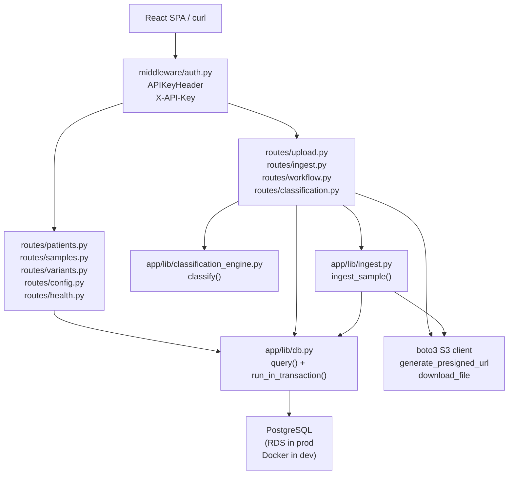

# DESIGN — variant-viewer API layer (PRs 6 & 7)

## 1. Problem statement

PRs 2–5 delivered the full business-logic backend (DB layer, VCF parser, FHIR
manifest, classification engine, ingest pipeline). PRs 6 and 7 expose that
logic over HTTP via FastAPI routes. The API must be:

- **Authenticated** — every route (except `/api/health`) requires a valid
  `X-API-Key` header. This satisfies the critical pre-clinical-use blocker
  identified in the compliance review.
- **Auditable** — every write produces an `audit_log` entry identifying the
  entity changed, the old value, the new value, and the user ID supplied by
  the client.
- **Non-blocking** — `db.py` uses psycopg2 (synchronous). All DB calls in
  async route handlers must be dispatched via `asyncio.to_thread`.

---

## 2. Architecture



---

## 3. Module responsibilities

### 3.1 `app/middleware/auth.py`

**Responsibilities:**
- Resolves the expected API key once at first use (lazy singleton).
- Resolution order: check `API_KEY_SECRET_ARN` → call Secrets Manager if set;
  otherwise read `API_KEY` env var directly. Raise `RuntimeError` if neither
  is set.
- Exposes a FastAPI `Depends` callable (`require_api_key`) that raises
  `HTTP 401` if the `X-API-Key` header is absent or does not match the
  resolved key.
- `/api/health` is exempt — do not apply `require_api_key` to the health route.

**Public interface:**
```python
async def require_api_key(
    api_key: str | None = Security(_api_key_header)
) -> str: ...

def _reset_resolved_key() -> None: ...   # test helper
```

**Must NOT:**
- Log the resolved key value at any level.
- Cache the key in a way that survives process restarts (the singleton resets
  on cold start, which is the expected Lambda behaviour).

**v0.1 limitation:** this is a single shared secret, not per-user auth.
Per-user OIDC authentication via ALB is the roadmap item for post-PR-12.
User identity for audit log purposes is asserted by the client in the request
body (`user_id: str` field on all write routes).

---

### 3.2 `app/lib/db.py` additions (PR 6)

Add one helper to `db.py` for use in async route handlers:

```python
from collections.abc import Callable
from typing import TypeVar

T = TypeVar("T")

def run_in_transaction(fn: Callable[[psycopg2.extensions.connection], T]) -> T:
    """Synchronous helper: opens a transaction, calls fn(conn), commits or rolls back.
    Designed to be passed to asyncio.to_thread() from async route handlers:
        result = await asyncio.to_thread(db.run_in_transaction, my_fn)
    """
    with with_transaction() as conn:
        return fn(conn)
```

This pattern lets write routes dispatch the entire transaction (including audit
log inserts) as a single `asyncio.to_thread` call, keeping all DB work on one
connection.

---

### 3.3 Route modules

All route modules follow the same structure:

```python
# routes/patients.py (example)
from fastapi import APIRouter, Depends, HTTPException, Query
import asyncio
from app.lib import db
from app.middleware.auth import require_api_key
from pydantic import BaseModel

router = APIRouter(prefix="/api/patients", dependencies=[Depends(require_api_key)])

@router.get("", response_model=PatientListResponse)
async def list_patients(...):
    rows = await asyncio.to_thread(db.query, SQL, params)
    ...
```

**Rules that apply to all route modules:**
- Use `asyncio.to_thread(db.query, sql, params)` for all SELECT queries.
- Use `asyncio.to_thread(db.run_in_transaction, fn)` for all writes.
- Never catch `psycopg2.OperationalError` in routes — let it propagate to
  FastAPI's default 500 handler.
- Return `HTTP 404` when a requested entity does not exist.
- Return `HTTP 409` for duplicate submission (DuplicateSubmissionError).
- Return `HTTP 400` for validation errors (ValueError, jsonschema.ValidationError).
- Return `HTTP 422` for invalid workflow state transitions.
- All 4xx responses use FastAPI's default `{"detail": str}` shape.

---

### 3.4 Route catalogue

#### PR 6 — Read-only routes

| Method | Path | Auth | Description |
|---|---|---|---|
| GET | `/api/health` | No | Liveness probe |
| GET | `/api/patients` | Yes | Paginated patient list with optional `search` |
| GET | `/api/patients/{patient_id}` | Yes | Patient detail + sample list |
| GET | `/api/samples/{sample_id}` | Yes | Sample detail + patient + workflow status + variant count |
| GET | `/api/samples/{sample_id}/variants` | Yes | Paginated variant list with classification summary |
| GET | `/api/variants/{variant_id}` | Yes | Variant detail + active classification + criteria |
| GET | `/api/config/criteria/{framework}` | Yes | Criteria list + combination rules for `acgs_snv` or `svig` |

#### PR 7 — Write routes

| Method | Path | Auth | Description |
|---|---|---|---|
| POST | `/api/upload-url` | Yes | Generate presigned S3 PUT URLs for VCF + manifest |
| POST | `/api/ingest` | Yes | Manually trigger ingest from an S3 key pair |
| PUT | `/api/workflow/{sample_id}` | Yes | Advance workflow status |
| POST | `/api/variants/{variant_id}/classify` | Yes | Score criteria — returns result without persisting |
| PUT | `/api/variants/{variant_id}/classification` | Yes | Score + persist classification and criteria; locks record |
| DELETE | `/api/variants/{variant_id}/classification/{classification_id}` | Yes | Soft-delete + replace with blank classification |

---

### 3.5 Request/response models

Define Pydantic v2 `BaseModel` response schemas in each route module.
Do not reuse `app.lib.models` entities directly as HTTP response models —
the DB entities are flat; HTTP responses are often composite (e.g. patient +
samples list). Define separate `*Response` and `*Request` models in the route
modules.

Key composite response types:

**`PatientListResponse`**
```python
class PatientSummary(BaseModel):
    id: int
    lab_number: str
    name: str | None

class PatientListResponse(BaseModel):
    items: list[PatientSummary]
    total: int
    limit: int
    offset: int
```

**`PatientDetailResponse`**
```python
class SampleSummary(BaseModel):
    id: int
    name: str
    case_type: str
    pipeline_key: str | None
    ingested_at: datetime | None
    workflow_status: str | None   # joined from workflow table

class PatientDetailResponse(PatientSummary):
    created_at: datetime | None
    samples: list[SampleSummary]
```

**`SampleDetailResponse`**
```python
class SampleDetailResponse(BaseModel):
    id: int
    name: str
    s3_key: str
    case_type: str
    pipeline_key: str | None
    tissue: str | None
    sequencing_date: date | None
    ingested_at: datetime | None
    patient: PatientSummary
    workflow_status: str
    variant_count: int
```

**`VariantSummary`** (used in sample variant list)
```python
class VariantSummary(BaseModel):
    id: int
    chrom: str
    pos: int
    ref: str
    alt: str
    gene: str | None
    consequence: str | None
    gnomad_af: float | None
    revel_score: float | None
    spliceai_max: float | None
    classification: str | None   # from active variant_classification
    score: int | None
    framework: str | None
    locked_at: datetime | None

class VariantListResponse(BaseModel):
    items: list[VariantSummary]
    total: int
    limit: int
    offset: int
```

**`VariantDetailResponse`**
```python
class CriterionDetail(BaseModel):
    id: int
    criterion_code: str
    applied: bool
    strength: str
    notes: str | None
    evidence_links: list[str]
    pre_computed: bool
    pre_computed_value: str | None

class ClassificationDetail(BaseModel):
    id: int
    framework: str
    framework_version: str
    score: int | None
    classification: str | None
    locked_at: datetime | None
    locked_by: str | None
    criteria: list[CriterionDetail]

class VariantDetailResponse(BaseModel):
    id: int
    chrom: str; pos: int; ref: str; alt: str
    gene: str | None; consequence: str | None
    hgvs_c: str | None; hgvs_p: str | None
    gnomad_af: float | None; revel_score: float | None; spliceai_max: float | None
    clinvar_sig: str | None
    info_json: dict
    active_classification: ClassificationDetail | None
```

**Write request bodies:**

```python
# POST /api/upload-url
class UploadUrlRequest(BaseModel):
    vcf_filename: str    # e.g. "26041S0057.vcf.gz"
    run_date: str | None = None   # "YYYY-MM-DD"; defaults to today

# POST /api/ingest
class IngestRequest(BaseModel):
    vcf_s3_key: str
    user_id: str

# PUT /api/workflow/{sample_id}
class WorkflowUpdateRequest(BaseModel):
    status: Literal["reviewing", "reported", "archived"]
    user_id: str

# POST /api/variants/{variant_id}/classify  (score only)
class ClassifyRequest(BaseModel):
    criteria: list[AppliedCriterionRequest]
    framework: Framework
    combination_rules: list[CombinationRuleRequest]

# PUT /api/variants/{variant_id}/classification  (score + persist)
class ClassificationSubmitRequest(BaseModel):
    criteria: list[AppliedCriterionRequest]
    framework: Framework
    combination_rules: list[CombinationRuleRequest]
    locked_by: str   # analyst identity (user_id asserted by client)
    user_id: str     # audit log identity

@dataclass
class AppliedCriterionRequest(BaseModel):
    criterion_code: str
    applied: bool
    strength: Strength
    notes: str | None = None
    evidence_links: list[str] = []
    pre_computed: bool = False
    pre_computed_value: str | None = None

@dataclass
class CombinationRuleRequest(BaseModel):
    rule: str
    codes: list[str]
    message: str
```

---

### 3.6 DB query patterns

**Rule:** all SQL is inline in route handlers or in small helper functions within
the route module. Do not create a separate ORM or query-builder layer for PRs 6–7.

**Key queries:**

*Patient list (with optional search):*
```sql
SELECT id, lab_number, name FROM patients
WHERE lab_number ILIKE %s OR name ILIKE %s   -- omit WHERE if no search
ORDER BY lab_number
LIMIT %s OFFSET %s
```
Count query runs separately: `SELECT COUNT(*) AS n FROM patients [WHERE ...]`.

*Sample detail (single query with joins):*
```sql
SELECT s.id, s.name, s.s3_key, s.case_type, s.pipeline_key, s.tissue,
       s.sequencing_date, s.ingested_at,
       p.id AS patient_id, p.lab_number, p.name AS patient_name,
       COALESCE(w.status, 'pending') AS workflow_status,
       COUNT(v.id) AS variant_count
FROM samples s
JOIN patients p ON p.id = s.patient_id
LEFT JOIN workflow w ON w.sample_id = s.id
LEFT JOIN variants v ON v.sample_id = s.id
WHERE s.id = %s
GROUP BY s.id, p.id, w.status
```

*Variant list for a sample (with classification summary):*
```sql
SELECT v.id, v.chrom, v.pos, v.ref, v.alt, v.gene, v.consequence,
       v.gnomad_af, v.revel_score, v.spliceai_max,
       vc.classification, vc.score, vc.framework, vc.locked_at
FROM variants v
LEFT JOIN variant_classification vc
       ON vc.variant_id = v.id AND vc.deleted_at IS NULL
WHERE v.sample_id = %s
ORDER BY v.chrom, v.pos
LIMIT %s OFFSET %s
```

*Variant detail (three queries in sequence):*
```sql
-- 1. Variant + case_type (needed by classification engine)
SELECT v.*, s.case_type FROM variants v
JOIN samples s ON s.id = v.sample_id WHERE v.id = %s

-- 2. Active classification
SELECT * FROM variant_classification
WHERE variant_id = %s AND deleted_at IS NULL

-- 3. Criteria for that classification
SELECT * FROM classification_criterion WHERE classification_id = %s ORDER BY id
```

*Audit log write (all writes use this pattern):*
```sql
INSERT INTO audit_log (user_id, action, entity_type, entity_id, old_value, new_value)
VALUES (%s, %s, %s, %s, %s, %s)
```
`old_value` and `new_value` are `json.dumps(dict)` or `None`. Action strings:
`classify`, `update_workflow`, `reset_classification`, `ingest`.

---

### 3.7 Workflow state machine

Valid status transitions (enforced by `PUT /api/workflow/{sample_id}`):

```
pending → reviewing → reported
    ↘         ↘          ↘
                      archived
```

Any attempt to move to an invalid next state returns `HTTP 422`:
```json
{"detail": "Invalid transition: pending → reported"}
```

Transition table:
```python
VALID_TRANSITIONS: dict[str, list[str]] = {
    "pending":   ["reviewing", "archived"],
    "reviewing": ["reported", "archived"],
    "reported":  ["archived"],
    "archived":  [],
}
```

---

### 3.8 Presigned URL strategy

`POST /api/upload-url` generates two presigned S3 PUT URLs (VCF + manifest sidecar).

```python
bucket = os.environ["VCF_BUCKET_NAME"]
date_prefix = body.run_date or datetime.today().strftime("%Y-%m-%d")

vcf_key      = f"runs/{date_prefix}/{body.vcf_filename}"
manifest_key = re.sub(r'\.vcf(\.gz)?$', '.manifest.json', vcf_key)

vcf_url      = s3.generate_presigned_url("put_object",
                   Params={"Bucket": bucket, "Key": vcf_key},
                   ExpiresIn=3600)
manifest_url = s3.generate_presigned_url("put_object",
                   Params={"Bucket": bucket, "Key": manifest_key},
                   ExpiresIn=3600)
```

The client (UploadForm in PR 11) uploads directly to S3 using these URLs, then
the Lambda trigger fires automatically. The `/api/ingest` endpoint provides an
alternative manual trigger path (useful for re-ingestion and for environments
without Lambda configured).

The `vcf_filename` must end with `.vcf` or `.vcf.gz`; return `HTTP 400` otherwise.

---

### 3.9 Config endpoint

`GET /api/config/criteria/{framework}` serves the criteria list and combination
rules from `backend/config/acgs-snv-criteria.json` or `svig-criteria.json`.
No DB call — loads the config file directly using `Path(__file__).parent.parent.parent`
path resolution (same pattern as `pipeline_config.py`). Returns `HTTP 400` if
the framework is not `acgs_snv` or `svig`.

This endpoint is consumed by the ClassificationPanel (PR 10) to build the
criteria checkbox list without hardcoding config in the frontend.

---

## 4. Error handling

| Exception | HTTP status | `detail` value |
|---|---|---|
| No / wrong `X-API-Key` | 401 | `"Invalid or missing API key"` |
| Entity not found | 404 | `"<Entity> not found"` |
| `DuplicateSubmissionError` | 409 | `"Duplicate submission: ..."` |
| `ValueError` | 400 | Exception message |
| `jsonschema.ValidationError` | 400 | `"Manifest validation failed: ..."` |
| Invalid workflow transition | 422 | `"Invalid transition: {current} → {new}"` |
| `psycopg2.OperationalError` | 500 | (FastAPI default) |
| Any other unhandled exception | 500 | (FastAPI default — triggers Lambda retry if from Lambda) |

Catch only the exceptions listed above, explicitly, in each route. Do not use
a blanket `except Exception` handler.

---

## 5. Testing strategy

All route tests use FastAPI's `TestClient` (from `starlette.testclient`), which
runs the ASGI app synchronously in a test thread. `asyncio.to_thread` dispatches
to a real thread pool inside TestClient's event loop — this means **patching
`db.query` directly** (via `unittest.mock.patch` or `monkeypatch`) works
correctly, because `asyncio.to_thread` calls the patched function in a thread.

The same applies to `db.run_in_transaction`: patch it to call a test-supplied
function instead of opening a real DB connection.

```python
# Fixture pattern for all route tests
@pytest.fixture
def client(monkeypatch):
    monkeypatch.setenv("API_KEY", "test-key")
    monkeypatch.setattr("app.middleware.auth._resolved_key", None)  # reset singleton
    from app.main import app
    with TestClient(app) as c:
        yield c

HEADERS = {"X-API-Key": "test-key"}
```

Mock `db.query` per-test using `monkeypatch.setattr`:
```python
def test_list_patients(client, monkeypatch):
    monkeypatch.setattr("app.lib.db.query", lambda sql, params=(): [
        {"id": 1, "lab_number": "LAB-001", "name": "Jane Smith"},
    ])
    # count query also needs mocking — return different data per SQL prefix
    ...
    r = client.get("/api/patients", headers=HEADERS)
    assert r.status_code == 200
```

For write routes that use `db.run_in_transaction`, patch it to call the provided
function with a mock connection:
```python
mock_conn = MagicMock()
mock_conn.cursor.return_value.__enter__ = lambda s: s
mock_conn.cursor.return_value.__exit__ = MagicMock(return_value=False)
mock_conn.cursor.return_value.execute = MagicMock()
mock_conn.cursor.return_value.fetchone.return_value = (42,)

monkeypatch.setattr("app.lib.db.run_in_transaction",
    lambda fn: fn(mock_conn))
```

---

## 6. Security alignment

| Control | Implementation |
|---|---|
| Authentication | `X-API-Key` required on all routes (except `/api/health`) |
| Credentials not logged | `auth.py` must not log the key value; same rule as `db.py` |
| Audit log | All write routes insert to `audit_log` (append-only trigger enforced at DB level) |
| Encryption in transit | Inherited from ALB (HTTPS termination) + `sslmode=require` on RDS in production |
| Data minimisation | Response models exclude `info_json` from list views; only returned in detail endpoint |

---

## 7. Limitations

1. **Shared API key, not per-user** — v0.1 has one API key for all clients. User
   identity in `audit_log` is the `user_id` string supplied by the client in the
   request body. Per-user OIDC via ALB is post-PR-12.
2. **No pagination cursor** — all list endpoints use `limit` + `offset` pagination.
   Cursor-based pagination is deferred; `offset` pagination is sufficient for the
   expected dataset sizes.
3. **No real-DB integration tests** — route tests mock `db.query`. End-to-end
   tests against a running PostgreSQL are PR 12.
4. **S3 client created per request in `/api/upload-url`** — acceptable for
   presigned URL generation (cheap call); a module-level singleton is out of
   scope for v0.1.
5. **`/api/ingest` runs synchronously in the request cycle** — `ingest_sample()`
   can take several seconds on large VCFs. For v0.1 this is acceptable; moving
   to a background task (FastAPI `BackgroundTasks` or SQS) is a future improvement.
