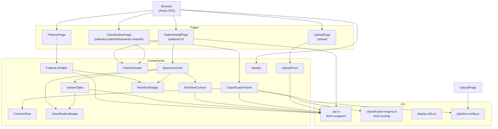

# DESIGN — variant-viewer frontend SPA (PRs 8–11)

## 1. Problem statement

The Next.js 15 prototype on `discovery/nextjs` couples server-side data fetching
(direct PostgreSQL queries in React Server Components) with client-side
interactivity (classification panel, workflow controls, upload form). This makes
independent deployment and scaling of the frontend impractical. PRs 8–11 port
the UI into a standalone React SPA that talks exclusively to the FastAPI backend
via REST, enabling the frontend to be served from S3/CloudFront or an nginx
container without any Node.js runtime in production.

The reference implementation in `discovery/nextjs` is authoritative for:
- Visual design (layout, colour palette, component structure)
- Classification engine logic (`lib/classification-engine.ts`)
- Upload flow (presigned S3 in prod; direct multipart in dev)
- Data privacy rules (MRN only; no name/DOB/NHS number displayed — dob removed by migration 004)

---

## 2. Architecture



---

## 3. Module responsibilities

### 3.1 `src/lib/api.ts`

**Responsibilities:**
- Exports one typed async function per backend operation.
- Constructs `fetch` calls with correct method, headers (`Content-Type`,
  `X-API-Key` when `VITE_API_KEY` is set), and body serialisation.
- Throws a typed `ApiError` (extends `Error`) carrying `status: number` and
  `detail: string` when the response is not 2xx.
- Returns parsed JSON typed to the response schema.

**Must NOT:**
- Log or expose the API key value in error messages or console output.
- Perform any business logic beyond request/response mapping.

**Public interface:**

```typescript
export class ApiError extends Error {
  constructor(public status: number, public detail: string) { super(detail); }
}

// Patients
export async function listPatients(params?: { search?: string; limit?: number; offset?: number }): Promise<PatientListResponse>
export async function getPatient(id: number): Promise<PatientDetailResponse>
export async function deletePatient(id: number): Promise<void>

// Samples
export async function getSample(id: number): Promise<SampleDetailResponse>
export async function deleteSample(id: number): Promise<void>

// Variants
export async function listVariants(sampleId: number, params?: VariantFilterParams): Promise<VariantListResponse>
export async function getVariant(id: number): Promise<VariantDetailResponse>

// Upload / ingest
export async function getUploadUrl(params: UploadUrlParams): Promise<UploadUrlResponse>
export async function ingestSample(params: IngestParams): Promise<IngestResponse>

// Workflow
export async function updateWorkflow(sampleId: number, status: WorkflowStatus, userId: string): Promise<WorkflowUpdateResponse>

// Classification
export async function scoreClassification(variantId: number, payload: ClassifyPayload): Promise<ClassifyResponse>
export async function putClassification(variantId: number, payload: ClassifyPersistPayload): Promise<ClassifyPersistResponse>
export async function resetClassification(variantId: number, classificationId: number, userId: string): Promise<ResetResponse>

// Config
export async function getCriteriaConfig(framework: string): Promise<CriteriaConfigResponse>
```

---

### 3.2 `src/lib/classification-engine.ts`

**Responsibilities:**
- Direct TypeScript port of `discovery/nextjs:lib/classification-engine.ts`.
- Exports `classify(criteria, framework, combinationRules)` returning
  `{ score, classification, warnings }`.
- Exports `selectFramework(caseType, gene)` returning `{ framework }`.
- Exports `classificationLabel(cls)` and `classificationBadgeClass(cls)` for
  display formatting.
- Runs entirely in-browser; no network calls.

**Must NOT:**
- Differ from the TypeScript reference in scoring logic, thresholds, or label
  strings — the Python backend's `classification_engine.py` must produce
  identical outputs for the same inputs.

**Algorithm (Tavtigian point-scoring, ACGS SNV):**

1. Map each applied criterion to its point weight:
   `very_strong=8, strong=4, moderate=2, supporting=1,
    stand_alone=∞, benign_stand_alone=−∞,
    benign_strong=−4, benign_moderate=−2, benign_supporting=−1`.
2. Sum all weights → `score`.
3. Evaluate `combinationRules` (e.g. two PM criteria count as one PS criterion).
4. Apply classification thresholds:
   `score ≥ 10 → Pathogenic, 6–9 → Likely_Pathogenic, 0–5 → VUS, −1 to −5 → Likely_Benign, ≤ −6 → Benign`.
   `stand_alone → Pathogenic` (score=999 sentinel).
   `benign_stand_alone → Benign` (score=−999 sentinel).
5. Evaluate `warnings` for contradictory simultaneous pathogenic + benign
   stand-alone criteria.

**SVIG-UK:** same structure with different criteria codes and thresholds (see
`svig-criteria.json`).

---

### 3.3 `src/lib/display-utils.ts`

**Responsibilities:**
- `formatYearOfBirth(dob)` — extracts 4-digit year from ISO date; returns `"—"` for null.
- `formatGnomadAf(af)` — exponential notation below 0.0001, 4 d.p. otherwise; `"absent"` for null.
- `formatRevel(v)` — 3 d.p., `"—"` for null.
- `formatSpliceAi(v)` — 3 d.p., `"—"` for null.
- `gnomadAfClass(af)` — returns Tailwind colour class (`text-amber-600` if > 0.01, else `text-gray-700`).
- `revelClass(v)` — `text-red-600` if ≥ 0.7, `text-green-700` if ≤ 0.4, `text-gray-700` otherwise.
- `spliceAiClass(v)` — `text-orange-600` if ≥ 0.5, else `text-gray-700`.

**Must NOT:** make network calls or import React.

---

### 3.4 `src/lib/pipeline-config.ts`

**Responsibilities:**
- Fetches `GET /api/config/criteria/{framework}` once per framework key (lazy cache).
- Exports `getPipelineDefaults(pipelineKey)` returning `PipelineFilters`
  (`gnomad_af_max`, `consequences`, `clinvar_exclude`).
- Exports `getPipelineOptions()` returning `{ key, label }[]` for the upload form.

**Note:** In the Next.js reference, `pipeline-config.ts` reads a YAML file at
build time. In the SPA, pipeline defaults are served by
`GET /api/config/criteria/{framework}` and the pipeline list comes from a small
static JSON file bundled with the SPA (`/src/config/pipelines.json`).

---

### 3.5 `src/components/Navbar.tsx`

**Responsibilities:**
- Renders the top navigation bar: "Variant Viewer" logo link to `/`, "Cases"
  link to `/`, "Upload VCF" link to `/upload`.
- Purely presentational; no state.

---

### 3.6 `src/components/PatientListTable.tsx`

**Responsibilities:**
- Renders a `<table>` of patient rows.
- Columns: MRN (`lab_number`), Specimens
  (`sample_count`), Latest Specimen, Pipeline, Workflow (`<WorkflowBadge>`),
  Ingested (en-GB date), View → link, Delete (`DeletePatientButton`).
- Must NOT display `name` or `nhs_number` columns.

**Multi-step delete algorithm for `DeletePatientButton`:**

1. Render "Delete" button.
2. On click: show inline confirm with patient MRN.
3. On confirm: call `deletePatient(id)`.
4. On success: call `router.push("/")` to return to the patient list.
5. On error: display inline error message; keep confirm open.

---

### 3.7 `src/components/SpecimenCard.tsx`

**Responsibilities:**
- Renders a white card header showing specimen name, case type badge, pipeline
  badge, `<WorkflowBadge>`, variant count, tissue, sequencing date, ingest date.
- Renders `<WorkflowControl>` and `<DeleteSampleButton>` in the card header.
- Renders `<VariantTable>` below the header.

**Multi-step delete algorithm for `DeleteSampleButton`:**

1. Render "Delete specimen" button.
2. On click: show inline confirm. If workflow status is `reported` or `archived`,
   show high-risk warning message.
3. On confirm: call `deleteSample(id)`.
4. On success: call `router.refresh()` (React Router — navigate to same URL to
   refetch parent page).
5. On error: display inline error; keep confirm open.

---

### 3.8 `src/components/VariantTable.tsx`

**Responsibilities:**
- Fetches `GET /api/samples/{id}/variants` with server-side pagination and
  sorting via TanStack Table `manualPagination` + `manualSorting`.
- Manages filter state: `gnomad_af_max`, `consequences` (comma-sep string),
  `clinvar_exclude` (comma-sep string), `gene`.
- Initialises filter state from `defaultFilters` (pipeline preset).
- Renders filter bar above the table.
- Renders a "Classify →" link per row to `/patients/{patientId}/variants/{id}`.
- Highlights `gnomad_af > 0.01` in amber; REVEL ≥ 0.7 in red, ≤ 0.4 in green;
  SpliceAI ≥ 0.5 in orange.

**Fetch algorithm:**

1. On mount and on any change to `[pagination, sorting, gnomad_af_max, consequences, clinvar_exclude, gene]`:
   set `loading=true`, clear `error`.
2. Build `URLSearchParams` from state.
3. `fetch("/api/samples/${sampleId}/variants?${params}")`.
4. On 2xx: set `data` to `json.items` and `total` to `json.total`; set `loading=false`.
5. On error: set `error`; set `loading=false`.
6. Any filter change resets `pageIndex` to 0.

---

### 3.9 `src/components/WorkflowControl.tsx`

**Responsibilities:**
- Renders transition buttons for the current workflow status.
- Valid transitions (frontend mirror of backend state machine):
  `pending → [reviewing, archived]`,
  `reviewing → [reported, archived]`,
  `reported → [archived]`,
  `archived → []`.
- Calls `PUT /api/workflow/{sampleId}` with `{ status, user_id }`.
- On success: updates local `status` state.
- `user_id` is read from `VITE_USER_ID` env var (fallback `"analyst"`).

**Must NOT:** optimistically update status before the API responds.

---

### 3.10 `src/components/ClassificationPanel.tsx`

**Responsibilities:**
- Accepts `variantId`, `caseType`, `gene`, `initialClassification`,
  `initialCriteria` as props (passed from `ClassificationPage`).
- Manages `framework` (selector, locked after first criterion applied),
  `criteria` array (one entry per criterion definition), `classId`, `lockedAt`.
- Computes `{ score, classification, warnings }` live via
  `classification-engine.classify()`.
- Save draft: `PUT /api/variants/{variantId}/classification` with
  `locked_by=null` (requires pre-6 — current backend requires non-null).
- Confirm: `PUT /api/variants/{variantId}/classification` with
  `locked_by=userId`.
- Reset: `DELETE /api/variants/{variantId}/classification/{classId}` after
  confirm-in-place, then reinitialise state.

**Must NOT:**
- Allow framework change after any criterion has been applied or after locking.
- Allow criterion edits after locking (all inputs `disabled`).
- Accept evidence links with non-http/https protocols.

**Save algorithm:**

1. Build `criteria` payload from state (applied only, strength, notes,
   evidence_links).
2. `PUT /api/variants/{variantId}/classification`.
3. On success: update `classId`; if locking, set `lockedAt=now`.
4. On error: display `saveError` banner.

**Reset algorithm:**

1. Show inline confirm.
2. On confirm: `DELETE /api/variants/{variantId}/classification/{classId}`.
3. On success: set `classId=null`, `lockedAt=null`, `frameworkLocked=false`,
   reinitialise `criteria` from empty.

---

### 3.11 `src/components/CriterionRow.tsx`

**Responsibilities:**
- Renders one criterion: checkbox, code + description, pre-computed badge,
  (when applied) strength selector, notes textarea, evidence links list and
  add-link input.
- Validates evidence links: only `http:` and `https:` protocols accepted.
- Emits `onChange(Partial<CriterionState>)` on any field change.
- All inputs `disabled` when `locked=true`.

---

### 3.12 `src/components/UploadForm.tsx`

**Responsibilities:**
- Renders four-section form: Patient (lab_number), Specimen (name,
  case_type, sequencing_date), Pipeline (pipeline_key), VCF file input.
- In dev (`import.meta.env.DEV || VITE_APP_ENV==='development'`): builds `FormData`
  and posts to `POST /api/ingest-direct` directly (no S3 required).
- In prod: calls `POST /api/upload-url`, then PUTs manifest JSON and VCF file
  to the presigned S3 URLs.
- Tracks `phase`: `idle → requesting-urls → uploading-manifest → uploading-vcf
  → ingesting → done | error`.
- Must NOT display NHS number or patient name input fields.

---

### 3.13 Pages

| Page | Route | Fetches | Renders |
|---|---|---|---|
| `PatientsPage` | `/` | `GET /api/patients` → `r.items` | `<PatientListTable>` |
| `PatientDetailPage` | `/patients/:id` | `GET /api/patients/:id` → `r.samples` (SampleSummary[]); then `getSample(s.id)` per specimen for full SampleDetail (N+1 — acceptable at ≤10 specimens per patient) | `<PatientHeader>` + `<SpecimenCard>`s |
| `ClassificationPage` | `/patients/:patientId/variants/:variantId` | `GET /api/variants/:variantId` → split `r.active_classification` into `initialClassification` (minus `criteria`) and `initialCriteria` | Variant detail card + `<ClassificationPanel>` |
| `UploadPage` | `/upload` | — | `<UploadForm>` |

All pages show an inline error banner on fetch failure; no crash boundary needed.

---

## 4. Data model (TypeScript interfaces)

Interfaces reflect the actual backend response shapes. Fields marked
`// after pre-N` require the corresponding backend extension (REFERENCE.md §0).

```typescript
// Matches backend GET /api/patients items[] entry (after pre-1)
export interface PatientSummary {
  id: number;
  lab_number: string;
  name: string | null;           // not displayed in UI — privacy rule
  // dob removed — dropped by migration 004 (UK GDPR data-minimisation)
  sample_count: number;          // (after pre-1)
  latest_sample_id: number | null;      // (after pre-1)
  latest_sample_name: string | null;    // (after pre-1)
  latest_workflow_status: string | null; // (after pre-1)
  latest_ingested_at: string | null;    // (after pre-1)
  pipeline_key: string | null;          // (after pre-1)
}

// Nested sample entry in GET /api/patients/{id} response (after pre-7)
export interface SampleSummary {
  id: number;
  name: string;
  vcf_filename: string | null;   // (after pre-7)
  case_type: string;
  pipeline_key: string | null;
  ingested_at: string | null;
  workflow_status: string | null;
}

// Matches backend GET /api/patients/{id} response
// PatientDetailResponse extends PatientSummary in the backend, so it also carries
// all aggregate fields (sample_count etc.) with default values (0/null).
export interface PatientDetailResponse {
  id: number;
  lab_number: string;
  name: string | null;
  created_at: string | null;
  // dob removed — dropped by migration 004 (UK GDPR data-minimisation)
  // Aggregate fields inherited from PatientSummary — always 0/null from this endpoint:
  sample_count: number;
  latest_sample_id: number | null;
  latest_sample_name: string | null;
  latest_workflow_status: string | null;
  latest_ingested_at: string | null;
  pipeline_key: string | null;
  samples: SampleSummary[];
}

// Matches backend GET /api/samples/{id} response
export interface SampleDetail {
  id: number;
  name: string;
  s3_key: string;
  case_type: string;
  pipeline_key: string | null;
  tissue: string | null;
  sequencing_date: string | null;
  ingested_at: string | null;
  patient: { id: number; lab_number: string; name: string | null };
  workflow_status: string;
  variant_count: number;
}

// Matches backend GET /api/samples/{id}/variants items[] entry (after pre-2, pre-3)
export interface VariantRow {
  id: number;
  chrom: string;
  pos: number;
  ref: string;
  alt: string;
  gene: string | null;
  consequence: string | null;
  gnomad_af: number | null;
  revel_score: number | null;
  spliceai_max: number | null;
  classification: string | null;
  score: number | null;
  framework: string | null;
  locked_at: string | null;
  // After pre-3:
  hgvs_c: string | null;
  hgvs_p: string | null;
  clinvar_sig: string | null;
}

// Matches backend GET /api/variants/{id} response
export interface VariantDetailResponse {
  id: number;
  chrom: string;
  pos: number;
  ref: string;
  alt: string;
  gene: string | null;
  consequence: string | null;
  hgvs_c: string | null;
  hgvs_p: string | null;
  gnomad_af: number | null;
  revel_score: number | null;
  spliceai_max: number | null;
  clinvar_sig: string | null;
  info_json: Record<string, unknown>;
  case_type: string;  // "germline" | "somatic" — used to select classification framework
  active_classification: ClassificationDetail | null;
}

// active_classification has criteria nested inside it
export interface ClassificationDetail {
  id: number;
  framework: string;
  framework_version: string;
  score: number | null;
  classification: string | null;
  locked_at: string | null;
  locked_by: string | null;
  criteria: CriterionDetail[];
}

export interface CriterionDetail {
  id: number;
  criterion_code: string;
  applied: boolean;
  strength: string;
  notes: string | null;
  evidence_links: string[];
  pre_computed: boolean;
  pre_computed_value: string | null;
}

// PUT /api/variants/{id}/classification response
export interface ClassifyPersistResponse {
  classification_id: number;
  score: number;
  classification: string;
  warnings: string[];
}

// Pipeline default filters (from src/config/pipelines.json)
export interface PipelineFilters {
  gnomad_af_max: number | null; // null when user clears the filter input field
  consequences: string;    // comma-separated VEP consequence terms
  clinvar_exclude: string; // comma-separated ClinVar significance values
}
```

---

## 5. Error handling strategy

| Condition | Component | User-visible result |
|---|---|---|
| `ApiError` status 4xx on page-level fetch | Page | Inline red banner: `"Failed to load: <detail>"` |
| `ApiError` status 5xx on page-level fetch | Page | Inline red banner: `"Server error — please try again"` |
| Network error on page-level fetch | Page | Inline red banner: `"Network error — check connection"` |
| `ApiError` on `WorkflowControl.updateStatus` | `WorkflowControl` | Inline `text-red-600` error below buttons |
| `ApiError` on `ClassificationPanel.save` | `ClassificationPanel` | `saveError` banner inside panel |
| `ApiError` on `UploadForm.handleSubmit` | `UploadForm` | Red error section; phase → `error` |
| Invalid evidence link protocol | `CriterionRow` | Inline `linkError` state displayed as red text beneath the URL input (no `alert()`) |
| `ApiError` 409 on workflow update | `WorkflowControl` | `"Concurrent modification — please refresh"` |
| Variant not found (API 404) | `ClassificationPage` | React Router `<Navigate to="/" />` |

---

## 6. Styling conventions

All styling uses TailwindCSS utility classes with two custom component layers
defined in `src/index.css`:

**Badge classes** (for `WorkflowBadge` and `ClassificationBadge`):

| Class | Colour |
|---|---|
| `.badge-pending` | `bg-yellow-100 text-yellow-800` |
| `.badge-reviewing` | `bg-blue-100 text-blue-800` |
| `.badge-reported` | `bg-green-100 text-green-800` |
| `.badge-archived` | `bg-gray-100 text-gray-600` |
| `.badge-pathogenic` | `bg-red-100 text-red-800` |
| `.badge-likely-pathogenic` | `bg-orange-100 text-orange-800` |
| `.badge-vus` | `bg-yellow-100 text-yellow-800` |
| `.badge-likely-benign` | `bg-blue-100 text-blue-800` |
| `.badge-benign` | `bg-green-100 text-green-800` |
| `.badge-oncogenic` | `bg-red-100 text-red-800` |
| `.badge-likely-oncogenic` | `bg-orange-100 text-orange-800` |

**Button classes:**

| Class | Style |
|---|---|
| `.btn-primary` | `bg-blue-600 text-white` |
| `.btn-secondary` | `bg-white text-gray-700 border-gray-300` |
| `.btn-danger` | `bg-red-600 text-white` |

**Typography:** `font-sans` → Inter; `font-mono` → JetBrains Mono.

---

## 7. Testing strategy

**Framework:** Vitest + `@testing-library/react` + `jsdom`.  
**Pattern:** render the component with props; assert rendered output. No Playwright/Cypress for PRs 8–11.

All network calls (`api.ts`) are mocked with `vi.mock("../lib/api")` at the
test module level. No real HTTP calls in tests.

| Module | What to mock | Key assertions |
|---|---|---|
| `PatientListTable` | — (pure render) | Lab number visible; name/NHS hidden; WorkflowBadge rendered |
| `PatientHeader` | — (pure render) | MRN displayed; no name/NHS |
| `WorkflowBadge` | — | Correct CSS class + label per status |
| `ClassificationBadge` | — | Correct class + label per classification |
| `SpecimenCard` | `api.ts` (no calls at render) | Specimen name, badge, variant count visible |
| `WorkflowControl` | `api.updateWorkflow` | Buttons rendered for valid transitions; on click calls API; status updates on success |
| `UploadForm` | `api.getUploadUrl`, `api.ingestSample`, `global.fetch` | Form fields present; dev submit calls ingest; prod calls upload-url; error displayed on failure |
| `ClassificationPanel` | `api.putClassification`, `api.resetClassification`; `classification-engine` (real) | Score computed locally; confirm calls API; reset calls DELETE; framework locked after criterion applied |
| `display-utils` | — | `formatYearOfBirth` returns year only; null → `"—"` |
| `api.ts` | `global.fetch` | `ApiError` thrown on non-2xx; correct URL constructed |

**Acceptance criteria (v0.1):**

- [ ] All Vitest tests pass (`npm test`)
- [ ] No TypeScript compiler errors (`tsc --noEmit`)
- [ ] `npm run build` produces `dist/` without errors
- [ ] Classification engine produces identical outputs to Python reference for
      all four golden fixture inputs (manual verification; automated in PR 12 E2E)

---

## 8. Limitations

1. **No pagination on patient list** — the reference implementation loads all
   patients in one query. The API supports `limit`/`offset` but the SPA does
   not use it in v0.1.
2. **Pipeline defaults from static JSON** — the Next.js reference read
   `pipelines.yaml` at build time. The SPA bundles `src/config/pipelines.json`
   as a static file; updating pipeline defaults requires a frontend redeploy.
3. **`user_id` is a static env var** — per-user identity requires OIDC (post-PR-12).
4. **No variant sorting persistence** — sort state resets on page navigation.
5. **Inline `linkError` state for invalid evidence links** — replaces reference `alert()`; rendered as
   replaced with an inline validation message in a future PR.
6. **VariantTable fetches on every filter keystroke** — the reference
   implementation does the same; debouncing is deferred to a future PR.

---

## 9. Compliance and security alignment

### 9.1 Data minimisation (DSPT / UK GDPR)

The SPA does not render `patients.name` or `patients.nhs_number` in any
component. These fields exist in the backend database and are returned by
`GET /api/patients/:id` but are not forwarded to any UI element. This is
enforced by the component contracts in §3.6 and §3.13.

Verification:
```bash
grep -r "nhs_number\|\.name" frontend/src/components/ frontend/src/pages/
# Expected: no output (or only comments)
```

### 9.2 Evidence link injection (DCB0129 hazard mitigation)

`CriterionRow` validates that evidence links use only `http:` or `https:`
protocols before adding them to state, preventing `javascript:` or `data:` URI
injection into the classification record.

Verification: `src/tests/CriterionRow.test.tsx` asserts that a `javascript:`
link is rejected.

### 9.3 API key never logged (CAF A2 / Invariant 1)

`api.ts` reads `VITE_API_KEY` from `import.meta.env`. The key value must never
appear in `console.log`, `console.error`, or `Error` messages.

Verification:
```bash
grep -r "VITE_API_KEY\|apiKey\|api_key" frontend/src/lib/api.ts
# Only the header assignment line should appear — never inside a string literal or log call
```

---

## 10. Use cases

1. **Primary — variant classification** — a bioinformatician opens the patient
   list, drills into a specimen, filters variants by gnomAD AF and consequence,
   clicks "Classify" on a candidate variant, selects ACGS SNV criteria, reviews
   the live score, and confirms the classification.
2. **Secondary — VCF upload** — a bioinformatician uploads a new VEP-annotated
   VCF for a patient; the form triggers ingestion and they are redirected to the
   patient list.
3. **Secondary — workflow management** — a team lead advances a specimen from
   `reviewing` to `reported` using the inline workflow control on the specimen card.
4. **Non-use-case** — administrative user management, audit log review, or
   compliance report generation. These are backend/database-level operations
   outside SPA scope.

---

## 11. Open design questions

1. **Pagination on patient list** — deferred to a future PR; v0.1 loads all
   patients.
2. **OIDC / per-user authentication** — `user_id` comes from `VITE_USER_ID` in
   v0.1; ALB OIDC integration is PR 12.
3. **Vite `/api` proxy in production** — in production, an nginx `proxy_pass`
   rule forwards `/api` requests to the FastAPI service. The nginx config is
   part of PR 12, not the SPA build.
